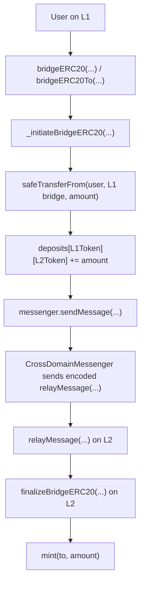
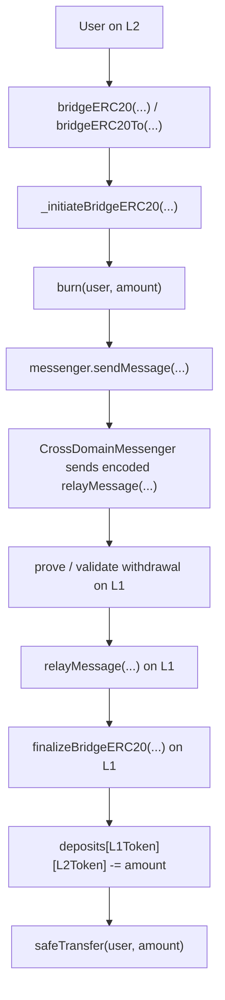

# Optimism Bridge Flow Local Review RU

Это русская версия учебного разбора Optimism-style bridge flow.

Цель репозитория - тренировать bridge security thinking:

```text
Понять flow -> определить инварианты -> искать нарушения
```

Это не официальный аудит. Это portfolio-style разбор architecture, function-by-function review, message passing, replay protection, auth boundaries и accounting invariants.

Исходные сниппеты основаны на Optimism Bedrock contracts:

```text
ethereum-optimism/optimism/packages/contracts-bedrock/src/
```

## Bridge Model

### Deposit Flow: L1 -> L2



Главный deposit invariant:

```text
L1 locked amount = L2 minted amount
```

### Withdrawal Flow: L2 -> L1



Главный withdrawal invariant:

```text
L2 burned amount = L1 released amount
```

## Core Functions Reviewed

Deposit:

```text
_initiateBridgeERC20(...)
sendMessage(...)
relayMessage(...)
finalizeBridgeERC20(...)
```

Withdrawal:

```text
_initiateBridgeERC20(...)
burn(...) branch
sendMessage(...)
finalizeBridgeERC20(...)
```

## Важная Optimism деталь

`StandardBridge._initiateBridgeERC20(...)` общий для L1 и L2 bridge.

```text
On L1 deposit:
canonical token -> safeTransferFrom(...) -> deposits += amount

On L2 withdrawal:
OptimismMintableERC20 -> burn(...)
```

## Структура

```text
optimism-bridge-flow-local-review-ru/
+-- README.md
+-- deposit-flow/
|   +-- 01-initiateBridgeERC20.md
|   +-- 02-sendMessage.md
|   +-- 03-relayMessage.md
|   +-- 04-finalizeBridgeERC20.md
+-- withdrawal-flow/
|   +-- 01-initiateBridgeERC20.md
|   +-- 02-burn.md
|   +-- 03-finalizeBridgeERC20.md
+-- break-think/
    +-- README.md
    +-- deposit-break-think.md
    +-- withdrawal-break-think.md
```
