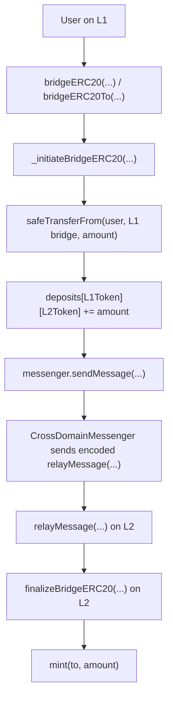
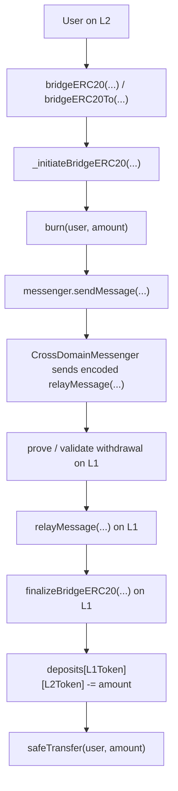

# Optimism Bridge Flow Local Review RU


Этот репозиторий - учебный local review Optimism-style bridge flow.

Цель - тренировать bridge security thinking:

```text
Understand the flow -> Define invariants -> Search for violations
```

Это не полный production audit. Это study repository, сфокусированный на bridge architecture, function-by-function review, message passing, replay protection, auth boundaries и accounting invariants.

Function code snippets взяты из официальных Optimism Bedrock contracts:

```text
ethereum-optimism/optimism/packages/contracts-bedrock/src/
```

Этот репозиторий следует Optimism bridge/message flow, а не Sky DSS accounting.

## Bridge Model

### Deposit Flow: L1 -> L2



Main deposit invariant:

```text
L1 locked amount = L2 minted amount
```

### Withdrawal Flow: L2 -> L1



Main withdrawal invariant:

```text
L2 burned amount = L1 released amount
```

## Core Functions Reviewed

Этот репозиторий сфокусирован на функциях, которые несут главную bridge logic.

### Main Deposit Functions

```text
_initiateBridgeERC20(...)
sendMessage(...)
relayMessage(...)
finalizeBridgeERC20(...)
```

### Main Withdrawal Functions

```text
_initiateBridgeERC20(...)
burn(...) branch
sendMessage(...)
finalizeBridgeERC20(...)
```

### Why These Functions Matter

```text
_initiateBridgeERC20(...) = source-chain accounting and message creation
sendMessage(...) = messenger message creation
relayMessage(...) = message validation, replay protection, and execution
finalizeBridgeERC20(...) = destination-chain mint or release
```

Important Optimism detail:

```text
StandardBridge._initiateBridgeERC20(...) is shared by L1 and L2 bridges.

On L1 deposit:
canonical token -> safeTransferFrom(...) -> deposits += amount

On L2 withdrawal:
OptimismMintableERC20 -> burn(...)
```

## Repository Structure

```text
optimism-bridge-flow-local-review-ru/
+-- README.md
+-- deposit-flow/
|   +-- 01-initiateBridgeERC20.md
|   +-- 02-sendMessage.md
|   +-- 03-relayMessage.md
|   +-- 04-finalizeBridgeERC20.md
+-- withdrawal-flow/
|   +-- 01-initiateBridgeERC20.md
|   +-- 02-burn.md
|   +-- 03-finalizeBridgeERC20.md
+-- break-think/
    +-- README.md
    +-- deposit-break-think.md
    +-- withdrawal-break-think.md
```

## Global Invariants

### Main Global Invariants

```text
L1 locked amount = L2 minted amount
```

```text
L2 burned amount = L1 released amount
```

```text
Only authentic bridge messages can mint or release tokens.
```

### Additional Deposit Invariants

```text
The L1 token must map to the correct L2 token.
```

```text
The recipient encoded in the message must be the intended recipient.
```

```text
The deposit message must be sent to the trusted counterpart bridge.
```

```text
The deposit message must be finalized only through an authentic messenger path.
```

```text
The same deposit message must not be executed twice.
```

### Additional Withdrawal Invariants

```text
The L2 token must map to the correct L1 token.
```

```text
The withdrawal recipient must be the intended recipient.
```

```text
The withdrawal message must be created only after the burn step.
```

```text
The withdrawal message must be finalized only through an authentic messenger path.
```

```text
The same withdrawal message must not be executed twice.
```

### Additional Messenger Invariants

```text
Only the trusted messenger can relay messages.
```

```text
The message hash must uniquely identify the sender, target, and calldata.
```

```text
The message must be marked as executed before the external target call.
```

```text
Validation must happen before execution.
```

```text
The target must be the intended destination contract.
```

## What I Practiced

- Deposit flow analysis
- Withdrawal flow analysis
- Message authenticity
- Replay protection
- `xDomainMessageSender`
- Ghost mint risk
- Fake release risk
- Accounting invariants
- Token conservation across chains

## Core Security Idea

```text
Real state transition
-> message creation
-> message validation
-> execution
-> mint / release
```

Если эта связь ломается, message перестает быть proof of real state.

Это может привести к:

```text
ghost mint
fake release
replay
double spend
unbacked liquidity
broken bridge accounting
```
